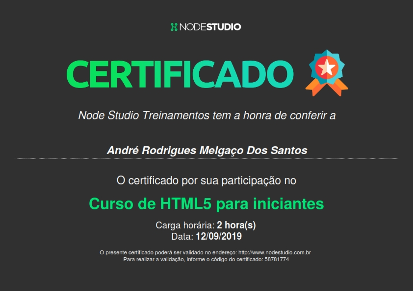

# Aprendendo HTML5
### Curso de HTML5 para iniciantes -  Node Studio Treinamentos - Usando Notepad++

### Desenvolvido por André Rodrigues.
### email de contato: dev-asantos@outlook.com

Clique [AQUI](https://github.com/MunrraMT/Aprendendo_HTML5) para ver o GitHUB.

Clique [AQUI](https://munrramt.github.io/Aprendendo_HTML5/Projeto-Final/projetofinal.html) para ver o projeto final do curso.

Críticas e sujestões seram bem vindos.
### Obrigado!
